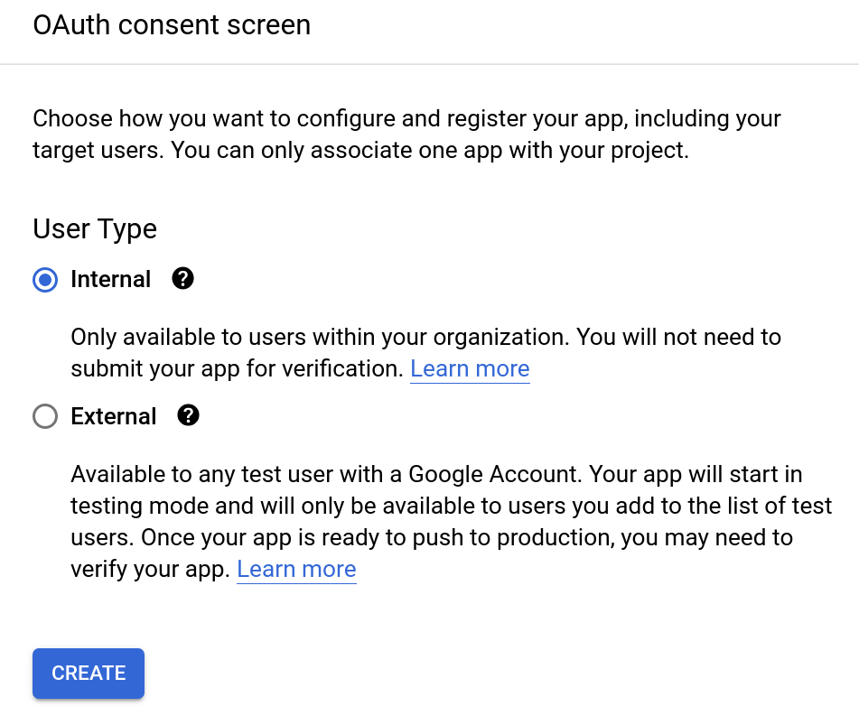
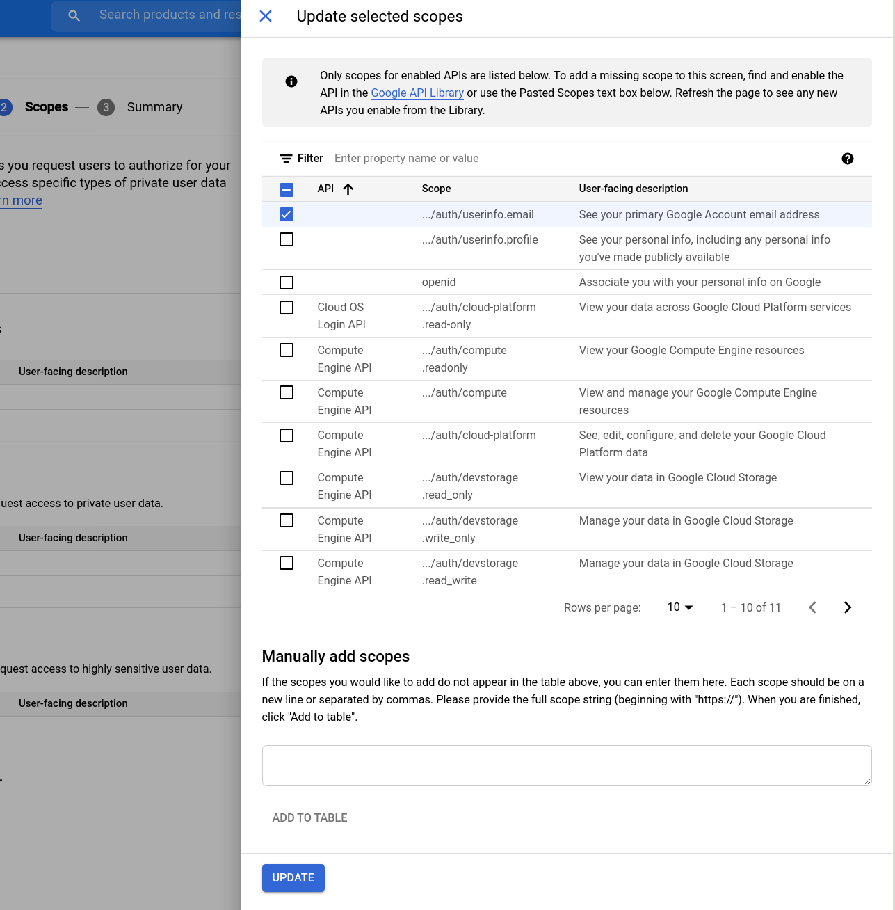
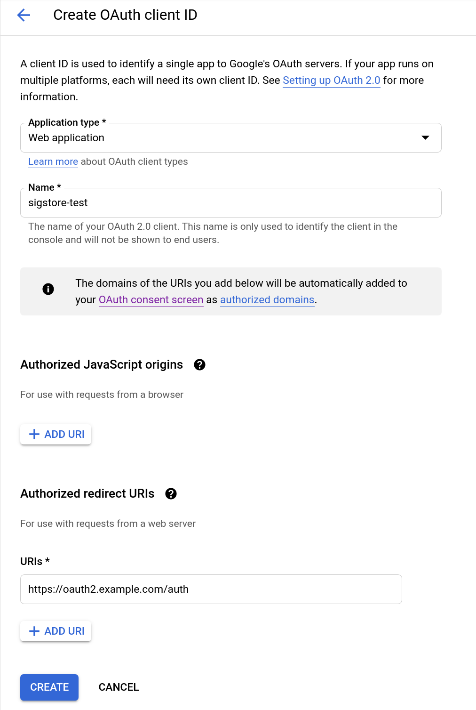

# Dex

Dex is the solution used for handling OpenID connect sessions.

A user first connects to a dex instance where an OpenID session is invoked.

The user then authorises Fulcio to request the users email address as part of an
OpenID scope. This email address is then recored into the x509 signing
certificates

Connect to the compute instance

```
gcloud compute ssh --zone "europe-west1-b" "sigstore-oauth2"  --project "sigstore-the-hard-way-proj"
```

## Dependencies

```
sudo apt-get update -y
```

```
sudo apt-get install haproxy make git gcc certbot -y
```

### Install go 1.16

Download and run the golang installer (system package is not yet 1.16)

```
curl -O https://storage.googleapis.com/golang/getgo/installer_linux
```

```
chmod +x installer_linux
```

```
./installer_linux
```

## Let's encrypt (TLS) & HA Proxy config


Let's create a HAProxy config, set `DOMAIN` to your registered domain and your
private `IP` address

Set up some specifics

```
DOMAIN=oauth2.yourdomain.com
IP=10.240.0.12
```

```
cat > ~/haproxy.cfg <<EOF
defaults
    timeout connect 10s
    timeout client 30s
    timeout server 30s
    log global
    mode http
    option httplog
    maxconn 3000
    log 127.0.0.1 local0

frontend haproxy
    #public IP address
    bind ${IP}:80
    bind ${IP}:443 ssl crt /etc/ssl/private/${DOMAIN}.pem

    # HTTPS redirect
    redirect scheme https code 301 if !{ ssl_fc }

    default_backend sigstore_oauth2

    acl letsencrypt-acl path_beg /.well-known/acme-challenge/
    use_backend letsencrypt-backend if letsencrypt-acl

    server sigstore_oauth2_internal 0.0.0.0:6000
```

```
sudo mv haproxy.cfg /etc/haproxy/
```

Let's now run certbot to obtain our TLS certs (change the email flag).

```
sudo certbot certonly --standalone --preferred-challenges http \
      --http-01-address ${IP} --http-01-port 80 -d ${DOMAIN} \
      --non-interactive --agree-tos --email jdoe@example.com
```


```
sudo cat "/etc/letsencrypt/live/${DOMAIN}/fullchain.pem" \
     "/etc/letsencrypt/live/${DOMAIN}/privkey.pem" \
     > "./${DOMAIN}.pem"

```

Move the PEM chain into place
```
sudo cp ./${DOMAIN}.pem /etc/ssl/private/${DOMAIN}.pem
```

### Start HAProxy

Let's now start HAProxy

```
sudo systemctl enable haproxy.service

Synchronizing state of haproxy.service with SysV service script with /lib/systemd/systemd-sysv-install.
Executing: /lib/systemd/systemd-sysv-install enable haproxy

sudo systemctl start haproxy.service

sudo systemctl status haproxy.service
● haproxy.service - HAProxy Load Balancer
   Loaded: loaded (/lib/systemd/system/haproxy.service; enabled; vendor preset: enabled)
   Active: active (running) since Sun 2021-07-18 10:12:28 UTC; 58min ago
     Docs: man:haproxy(1)
           file:/usr/share/doc/haproxy/configuration.txt.gz
 Main PID: 439 (haproxy)
    Tasks: 2 (limit: 2322)
   Memory: 4.1M
   CGroup: /system.slice/haproxy.service
           ├─439 /usr/sbin/haproxy -Ws -f /etc/haproxy/haproxy.cfg -p /run/haproxy.pid
           └─444 /usr/sbin/haproxy -Ws -f /etc/haproxy/haproxy.cfg -p /run/haproxy.pid

Jul 18 10:12:27 sigstore-fulcio systemd[1]: Starting HAProxy Load Balancer...
Jul 18 10:12:28 sigstore-fulcio systemd[1]: Started HAProxy Load Balancer.
```

## Install Dex

```
mkdir -p ~/go/src/github.com/dexidp/ && cd "$_"
git clone https://github.com/dexidp/dex.git
```

```
cd dex
make build
sudo mv bin/dex /usr/local/bin/
```

## Obtain Google OAUTH credentials

> 📝 We re using Google here, you can do the same for github and microsoft too.
  The placeholders are already within `config.yaml`

1. Head to the [credentials page](https://console.cloud.google.com/apis/credentials)

2. Select 'CONFIGURE CONSENT SCREEN'

Select 'Internal'



NOTE: If you're not a Google Workspace user, the 'Internal' option will not be available. You can only make your app available to external (general audience) users only. In such a case, the 'External' User Type works fine as well. 

Fill out the app resgistration details


3. Set scopes

Select 'ADD OR REMOVE SCOPES' and set the `userinfo.email` scope



Select "SAVE AND CONTINUE"

Select "BACK TO DASHBOARD" and select 'Credentials'

4. Create OAuth Client ID


Select "Web Application" and fill out the "Authorized Redirect URIs"

Select "CREATE"



5. Note down tour Client ID and Secret and keep them safe (we will need them for dex)

## Configure Dex

Set up the configuration file for dex.

```
cat > ~/dex-config.yaml <<EOF
issuer: https://${DOMAIN}/auth

storage:
  type: sqlite3
  config:
    file: dex.db
web:
  http: 0.0.0.0:5556
frontend:
  issuer: sigstore
  theme: light

# Configuration for telemetry
telemetry:
  http: 0.0.0.0:5558

# Options for controlling the logger.
logger:
  level: "debug"
  format: "json"

# Default values shown below
oauth2:
  responseTypes: [ "code" ]
  skipApprovalScreen: false
  alwaysShowLoginScreen: true

staticClients:
  - id: sigstore
    public: true
    name: 'sigstore'
    redirectURI: https://${DOMAIN}/auth/callback

connectors:
- type: google
  id: google-sigstore-test
  name: Google
  config:
    clientID: $GOOGLE_CLIENT_ID
    clientSecret: $GOOGLE_CLIENT_SECRET
    redirectURI: https://${DOMAIN}/auth/callback

#- type: microsoft
#  id: microsoft-sigstore-test
#  name: Microsoft
#  config:
#     clientID: $MSFT_CLIENT_ID
#     clientSecret: $MSFT_CLIENT_SECRET
#     redirectURI: https://${DOMAIN}/auth/callback

#- type: github
#  id: github-sigstore-test
#  name: GitHub
#  config:
#     clientID: $GITHUB_CLIENT_ID
#     clientSecret: $GITHUB_CLIENT_SECRET
#     redirectURI: https://${DOMAIN}/auth/callback
EOF
```

Afterwards open the file and replace `$GOOGLE_CLIENT_ID` with
your OAuth2 Client ID and the `$GOOGLE_CLIENT_SECRET` with your
OAuth2 Client Secret


## Start dex

```
dex serve --web-http-addr=0.0.0.0:6000  dex-config.yaml
```

Next: [Fulcio](06-fulcio.md)
