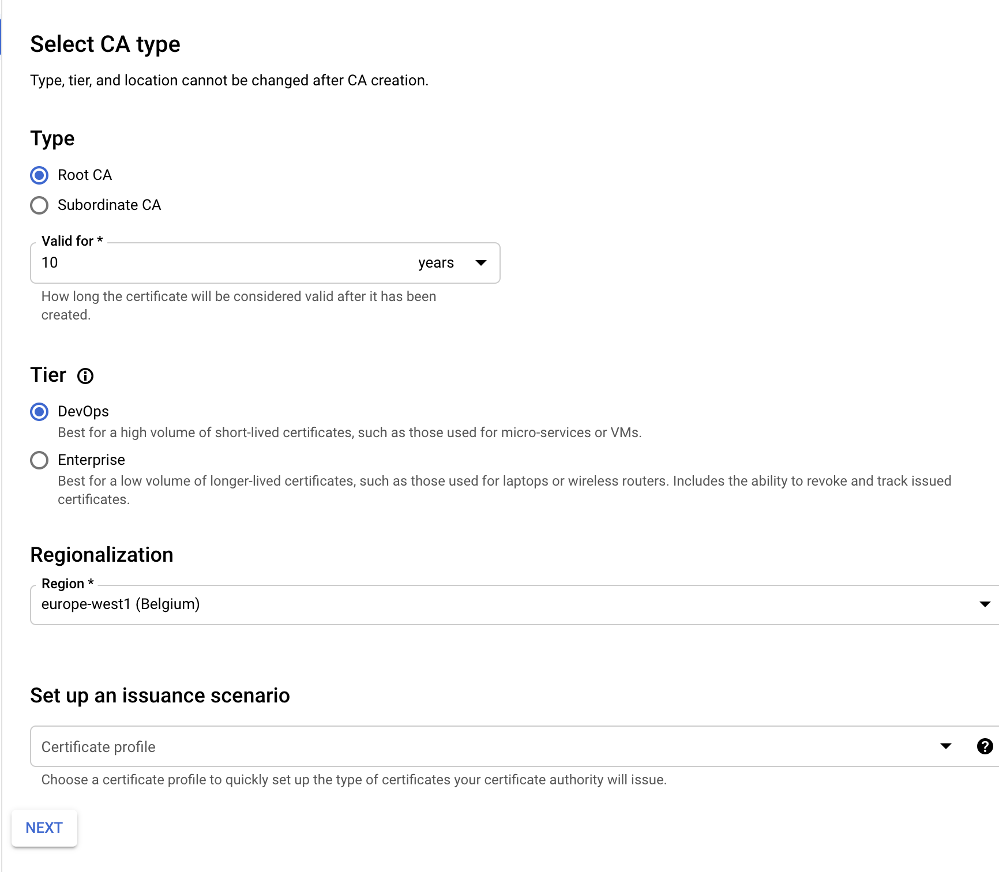
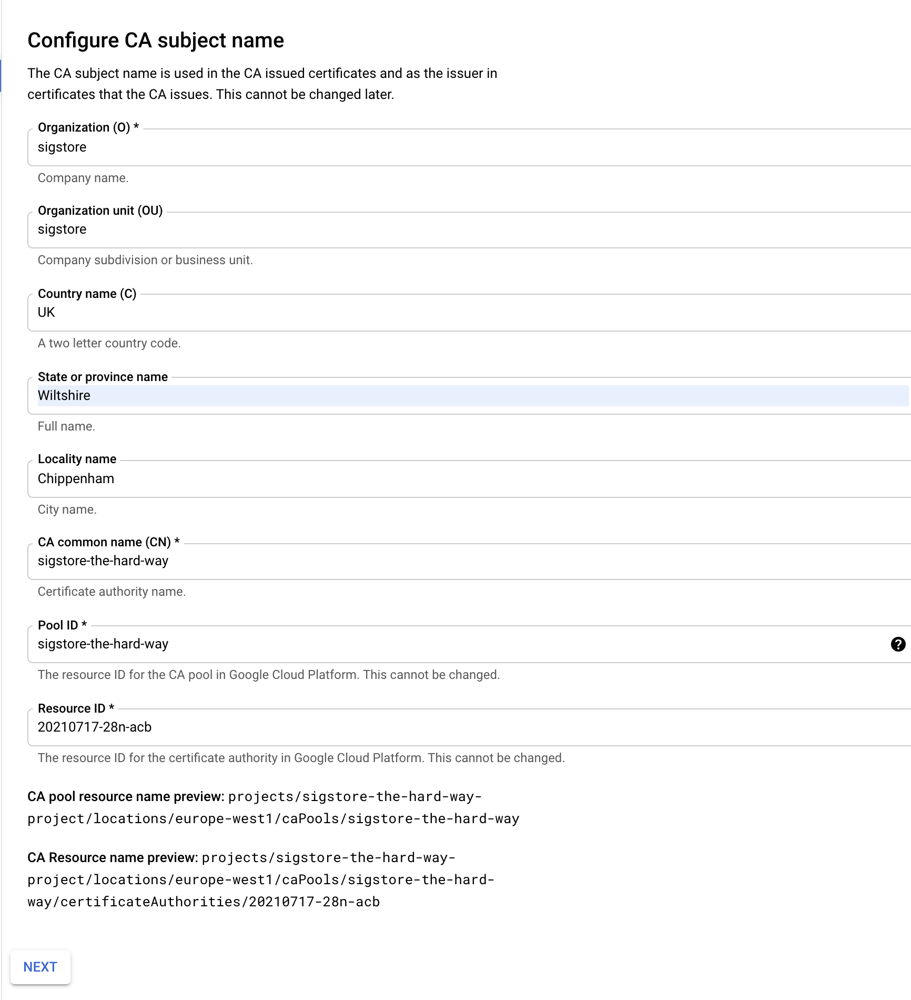

# Fulcio

Now it's time to install the Fulcio WebPKI.

Fulcio requires a means to manage certificates. We have two options here,
we can use a SoftHSM or Google Certificate Authority service.

> 📝 As of time of writing, plans are in place to support AWS Cloud HSM and
  Azure Dedicated HSM.

SSH into the Fulcio Compute instance

```
gcloud compute ssh --zone "europe-west1-b" "sigstore-fulcio"  --project "sigstore-the-hard-way-proj"
```

## Dependencies

We need a few dependencies installed

Update your system

```
sudo apt-get update -y
```

Grab the following packages

```
sudo apt-get install git gcc haproxy softhsm certbot opensc -y
```

> 📝 If you plan to use GCP Certificate Service, you can drop SoftHSM and opensc

### Install go 1.16

Download and run the golang installer (system package is not yet 1.16)

```
curl -O https://storage.googleapis.com/golang/getgo/installer_linux
```

```
chmod +x installer_linux
```

```
./installer_linux
```

## Install Fulcio

```
go get -u github.com/sigstore/fulcio@0.1.0
```

# SoftHSM Installation

## Configure the HSM

```
mkdir /tmp/tokens ~/config
```

```
cat > config/softhsm2.cfg<<EOF
directories.tokendir = /tmp/tokens
objectstore.backend = file
log.level = INFO
EOF
```

```
export SOFTHSM2_CONF=`pwd`/config/softhsm2.cfg`
```

```
echo "export SOFTHSM2_CONF=`pwd`/config/softhsm2.cfg" >> ~/.bash_profile`
```

```
softhsm2-util --init-token --slot 0 --label fulcio
```

For example:

```
softhsm2-util --init-token --slot 0 --label fulcio
=== SO PIN (4-255 characters) ===
Please enter SO PIN: ****
Please reenter SO PIN: ****
=== User PIN (4-255 characters) ===
Please enter user PIN: ****
Please reenter user PIN: ******
ERROR: The entered PINs are not equal.
=== User PIN (4-255 characters) ===
Please enter user PIN: ****
Please reenter user PIN: ****
The token has been initialized and is reassigned to slot 1773686385
```

Now remembering you pin, lets create a SoftHSM config for Fulcio

```
cat > config/crypto11.conf <<EOF
{
  "Path" : "/usr/lib/softhsm/libsofthsm2.so",
  "TokenLabel": "fulcio",
  "Pin" : "2324"
}
EOF
```

Now let's create a private key within the HSM

```
pkcs11-tool --module /usr/lib/softhsm/libsofthsm2.so --login --login-type user --keypairgen --id 1 --label FulcioCA  --key-type EC:secp384r1
```

For example:

```
% pkcs11-tool --module /usr/lib/softhsm/libsofthsm2.so --login --login-type user --keypairgen --id 1 --label FulcioCA  --key-type EC:secp384r1
Using slot 0 with a present token (0x69b84e71)
Logging in to "fulcio".
Please enter User PIN:
Key pair generated:
Private Key Object; EC
label:      FulcioCA
ID:         01
Usage:      decrypt, sign, unwrap, derive
Access:     sensitive, always sensitive, never extractable, local
Public Key Object; EC  EC_POINT 384 bits
EC_POINT:   046104b04911577ad1a655ba469b32ae63832d6c0d19482058af1822c2b42f54934da3613cd87171594a9b00ff1f0b298c75fa9383470ec46f0b4a35e73b54c34cf2ecc664ada2d0a818a5ac2390d952cb3b8d66ebea974a1bb2465f323cbebc50927d
EC_PARAMS:  06052b81040022
label:      FulcioCA
ID:         01
Usage:      encrypt, verify, wrap, derive
Access:     local
```

Now its time to create a Root CA using our newly minted private key:

```
fulcio createca --org={ORG} --country={UK} --locality={TOWN} --province={PROVINCE} --postal-code={POST_CODE} --street-address={STREET} --hsm-caroot-id 1 --out fulcio-root.pem
```

An example

```
fulcio createca --org=acme --country=USA --locality=Anytown --province=AnyPlace --postal-code=ABCDEF --street-address=123 Main St --hsm-caroot-id 1 --out fulcio-root.pem
2021-07-12T15:12:36.868Z	INFO	app/createca.go:49	binding to PKCS11 HSM
2021-07-12T15:12:36.874Z	INFO	app/createca.go:69	finding slot for private key: FulcioCA
2021-07-12T15:12:36.889Z	INFO	app/createca.go:110	Root CA:
-----BEGIN CERTIFICATE-----
MIICazCCAfKgAwIBAgIIRLN8c3a+ZbEwCgYIKoZIzj0EAwMwbDELMAkGA1UEBhMC
VUsxEjAQBgNVBAgTCVdpbHRzaGlyZTETMBEGA1UEBxMKQ2hpcHBlbmhhbTETMBEG
A1UECRMKU3V0aGVybGFuZDEQMA4GA1UEERMHU04xNDZSUzENMAsGA1UEChMEYWNt
ZTAeFw0yMTA3MTIxNTEyMzZaFw0zMTA3MTIxNTEyMzZaMGwxCzAJBgNVBAYTAlVL
MRIwEAYDVQQIEwlXaWx0c2hpcmUxEzARBgNVBAcTCkNoaXBwZW5oYW0xEzARBgNV
BAkTClN1dGhlcmxhbmQxEDAOBgNVBBETB1NOMTQ2UlMxDTALBgNVBAoTBGFjbWUw
djAQBgcqhkjOPQIBBgUrgQQAIgNiAASwSRFXetGmVbpGmzKuY4MtbA0ZSCBYrxgi
wrQvVJNNo2E82HFxWUqbAP8fCymMdfqTg0cOxG8LSjXnO1TDTPLsxmStotCoGKWs
I5DZUss7jWbr6pdKG7JGXzI8vrxQkn2jYTBfMA4GA1UdDwEB/wQEAwIChDAdBgNV
HSUEFjAUBggrBgEFBQcDAgYIKwYBBQUHAwEwDwYDVR0TAQH/BAUwAwEB/zAdBgNV
HQ4EFgQU8261m0QO2o62/3ofyWkIOIuettMwCgYIKoZIzj0EAwMDZwAwZAIwUuRd
Ld9cFrDAIon/1l2UFyNfRlZia6h+HxQh3HP32DLhsiJlfziYQ5kqPPGmr7W0AjBC
l6GyXJFgW3z/o4Yb4gmkcifs898D5MwSsqmQmKH8rx3MhjbFg5gOaslj7xWJ5gQ=
-----END CERTIFICATE-----

2021-07-12T15:12:36.906Z	INFO	app/createca.go:124	root CA created with PKCS11 ID: 1
```

Transfer the root certificate over to the certificate transparency log

```
gcloud compute scp fulcio-root.pem <google_account_name>@sigstore-ctl:~/
```

# Google Certificate Authority Service

Navigate to the [Certificate Authority Service API](https://console.cloud.google.com/marketplace/product/google/privateca.googleapis.com) and enable the service


1. Set the CA type (DevOps)



2. Set the cert subject details



3. Set the key and algorithm to Ecliptic Curve P384


4. Leave Configure Artifacts as it is


5. Label (don't need one)


6. Create the CA


7. Note down the Root CA and Resource name


## Let's encrypt (TLS) & HA Proxy config

Set `DOMAIN` to your registered domain and your private IP address under `IP`

```
DOMAIN=fulcio.example.com
IP=10.240.0.11
EMAIL=luke@example.com
```


```
cat > ./haproxy.cfg <<EOF
defaults
    timeout connect 10s
    timeout client 30s
    timeout server 30s
    log global
    mode http
    option httplog
    maxconn 3000
    log 127.0.0.1 local0

frontend haproxy
    #public IP address
    bind ${IP}:80
    bind ${IP}:443 ssl crt /etc/ssl/private/${DOMAIN}.pem

    # HTTPS redirect
    redirect scheme https code 301 if !{ ssl_fc }

    default_backend sigstore_fulcio

    acl letsencrypt-acl path_beg /.well-known/acme-challenge/
    use_backend letsencrypt-backend if letsencrypt-acl

backend sigstore_fulcio
    server sigstore_fulcio_internal 0.0.0.0:5000

backend letsencrypt-backend
    server letsencrypt ${IP}:80
EOF
```

Inspect the resulting `haproxy.cfg` and make sure everything looks correct.

If so, move it into place

```
sudo mv haproxy.cfg /etc/haproxy/
```

Let's now run certbot to obtain our TLS certs.

```
sudo certbot certonly --standalone --preferred-challenges http \
      --http-01-address 10.240.0.11 --http-01-port 80 -d ${DOMAIN} \
      --non-interactive --agree-tos --email youremail@domain.com
```

Build a cert chain

```
sudo cat "/etc/letsencrypt/live/${DOMAIN}/fullchain.pem" \
     "/etc/letsencrypt/live/${DOMAIN}/privkey.pem" \
     > "./${DOMAIN}.pem"
```

Copy the PEM chain into place

```
sudo cp ./${DOMAIN}.pem ./${DOMAIN}.pem
```

Let's now start HAProxy

```
sudo systemctl enable haproxy.service

Synchronizing state of haproxy.service with SysV service script with /lib/systemd/systemd-sysv-install.
Executing: /lib/systemd/systemd-sysv-install enable haproxy

sudo systemctl start haproxy.service

sudo systemctl status haproxy.service
● haproxy.service - HAProxy Load Balancer
   Loaded: loaded (/lib/systemd/system/haproxy.service; enabled; vendor preset: enabled)
   Active: active (running) since Sun 2021-07-18 10:12:28 UTC; 58min ago
     Docs: man:haproxy(1)
           file:/usr/share/doc/haproxy/configuration.txt.gz
 Main PID: 439 (haproxy)
    Tasks: 2 (limit: 2322)
   Memory: 4.1M
   CGroup: /system.slice/haproxy.service
           ├─439 /usr/sbin/haproxy -Ws -f /etc/haproxy/haproxy.cfg -p /run/haproxy.pid
           └─444 /usr/sbin/haproxy -Ws -f /etc/haproxy/haproxy.cfg -p /run/haproxy.pid

Jul 18 10:12:27 sigstore-fulcio systemd[1]: Starting HAProxy Load Balancer...
Jul 18 10:12:28 sigstore-fulcio systemd[1]: Started HAProxy Load Balancer.
```

## Fulcio Config

```
sudo mkdir /etc/fulcio-config
```

Set the DNS for the OAuth2 / Dex Server

```
OAUTH2_DOMAIN=oauth2.example.com
```

```
cat > ./config.json <<EOF
    {
      "OIDCIssuers": {
        "https://accounts.google.com": {
          "IssuerURL": "https://accounts.google.com",
          "ClientID": "sigstore",
          "Type": "email"
        },
        "https://${OAUTH2_DOMAIN}/auth": {
          "IssuerURL": "https://${OAUTH2_DOMAIN}/auth",
          "ClientID": "sigstore",
          "Type": "email"
        }
      }
    }
EOF
```

Inspect `config.json` and if everything looks in order, copy it into place

```
sudo mkdir /etc/fulcio-config/
```

```
sudo mv config.json /etc/fulcio-config/`
````

# Start FulcioCA

We now have two methods of starting Fulcio depending on your Certificate
Authority system choice.

## SoftHSM

```
fulcio serve --ca=fulcioca --hsm-caroot-id=1 --ct-log-url=http://sigstore-ctl:6105/sigstore --host=0.0.0.0 --port=5000
```

> 📝 Don't worry that the Certificate Transparency Log is not up yet. We will
 set this up next.

## Google Certificate Authority Service


```
fulcio serve --ca googleca --gcp_private_ca_parent=${resource_name} --ct-log-url=http://sigstore-ctl:6105/sigstore --host=0.0.0.0 --port=5000
```

> 📝 Your resource name is a long POSIX type path string, e.g. `projects/sigstore-the-hard-way-proj/locations/europe-west1/caPools/sigstore-the-hard-way/certificateAuthorities/xxxx`

For example

```
fulcio serve -ca googleca ----gcp_private_ca_parentprojects/sigstore-the-hard-way-proj/locations/europe-west1/caPools/sigstore-the-hard-way/certificateAuthorities/xxxx --ctl-log-url=http://sigstore-ctl:6105/sigstore
```

Next: [Certificate Transparency](07-certifcate-transparency.md)
