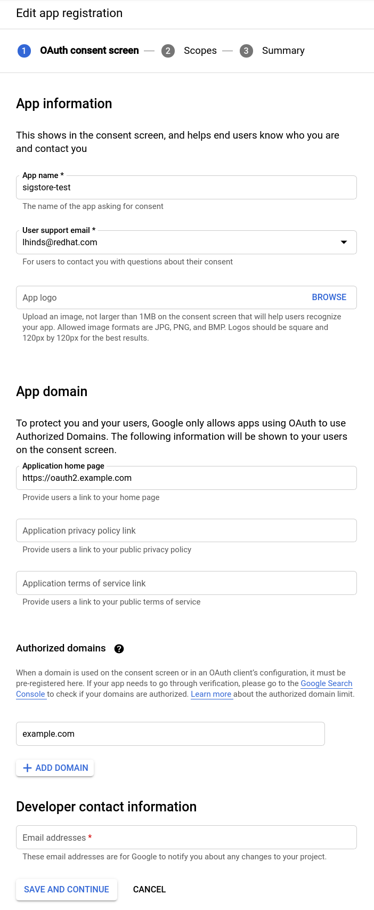
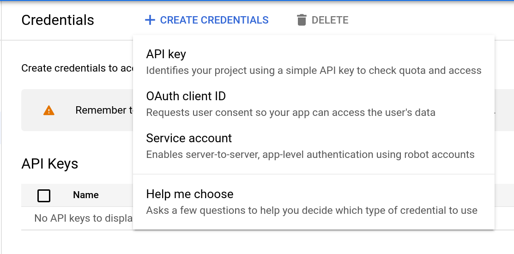

# Dex

Dex is the solution used for handling OpenID connect sessions.

A user first connects to a dex instance where an OpenID session is invoked.

The user then authorises Fulcio to request the users email address as part of an
OpenID scope. This email address is then recored into the x509 signing
certificates

Connect to the compute instance

```bash
gcloud compute ssh sigstore-oauth2
```

## Dependencies

```bash
sudo apt-get update -y
```

If you want to save up some time, remove man-db first

```bash
sudo apt-get remove -y --purge man-db
```

```bash
sudo apt-get install haproxy make git gcc certbot -y
```

### Install latest golang compiler

Download and run the golang installer (system package is not yet 1.16)

```bash
curl -O https://storage.googleapis.com/golang/getgo/installer_linux
```

```bash
chmod +x installer_linux
```

```bash
./installer_linux
```

e.g.

```
Welcome to the Go installer!
Downloading Go version go1.17.1 to /home/luke/.go
This may take a bit of time...
Downloaded!
Setting up GOPATH
GOPATH has been set up!

One more thing! Run `source /home/$USER/.bash_profile` to persist the
new environment variables to your current session, or open a
new shell prompt.
```

As suggested run

```bash
source /home/$USER/.bash_profile
go version
go version go1.17.1 linux/amd64
```

### Let's encrypt (TLS) & HA Proxy config

Let's create a HAProxy config, set `DOMAIN` to your registered domain and your
private `IP` address

```bash
DOMAIN="oauth2.yourdomain.com"
IP="10.240.0.12"
```

Let's now run certbot to obtain our TLS certs.

```bash
sudo certbot certonly --standalone --preferred-challenges http \
      --http-01-address ${IP} --http-01-port 80 -d ${DOMAIN} \
      --non-interactive --agree-tos --email youremail@domain.com
```

Move the PEM chain into place

```bash
sudo cat "/etc/letsencrypt/live/${DOMAIN}/fullchain.pem" \
    "/etc/letsencrypt/live/${DOMAIN}/privkey.pem" \
    | sudo tee "/etc/ssl/private/${DOMAIN}.pem" > /dev/null
```

Now we need to change certbot configuration for automatic renewal

Prepare post renewal script

```bash
cat /etc/letsencrypt/renewal-hooks/post/haproxy-ssl-renew.sh
#!/bin/bash

DOMAIN="oauth2.example.com"

cat "/etc/letsencrypt/live/${DOMAIN}/fullchain.pem" \
    "/etc/letsencrypt/live/${DOMAIN}/privkey.pem" \
    > "/etc/ssl/private/${DOMAIN}.pem"

systemctl reload haproxy.service
```

Make sure the script has executable flag set

```bash
sudo chmod +x /etc/letsencrypt/renewal-hooks/post/haproxy-ssl-renew.sh
```

Replace port and address in the certbot's renewal configuration file for the domain (pass ACME request through the haproxy to certbot)

```bash
ls -l /etc/letsencrypt/renewal/oauth2.example.com.conf
```

```
http01_port = 9080
http01_address = 127.0.0.1
```

Append new line

```
post_hook = /etc/letsencrypt/renewal-hooks/post/haproxy-ssl-renew.sh
```

Prepare haproxy configuration

```bash
cat > haproxy.cfg <<EOF
defaults
    timeout connect 10s
    timeout client 30s
    timeout server 30s
    log global
    mode http
    option httplog
    maxconn 3000
    log 127.0.0.1 local0

frontend haproxy
    #public IP address
    bind ${IP}:80
    bind ${IP}:443 ssl crt /etc/ssl/private/${DOMAIN}.pem

    # HTTPS redirect
    redirect scheme https code 301 if !{ ssl_fc }

    acl letsencrypt-acl path_beg /.well-known/acme-challenge/
    use_backend letsencrypt-backend if letsencrypt-acl

    default_backend sigstore_dex

backend sigstore_dex
    server sigstore_oauth2_internal ${IP}:6000

backend letsencrypt-backend
    server certbot_internal 127.0.0.1:9080
EOF
```

Inspect the resulting `haproxy.cfg` and make sure everything looks correct.

If so, move it into place

```bash
sudo mv haproxy.cfg /etc/haproxy/
```

Check syntax

```bash
sudo /usr/sbin/haproxy -c -V -f /etc/haproxy/haproxy.cfg
```

### Start HAProxy

Let's now start HAProxy

```bash
sudo systemctl enable haproxy.service

Synchronizing state of haproxy.service with SysV service script with /lib/systemd/systemd-sysv-install.
Executing: /lib/systemd/systemd-sysv-install enable haproxy
```

```bash
sudo systemctl restart haproxy.service
sudo systemctl status haproxy.service
● haproxy.service - HAProxy Load Balancer
   Loaded: loaded (/lib/systemd/system/haproxy.service; enabled; vendor preset: enabled)
   Active: active (running) since Sun 2021-07-18 10:12:28 UTC; 58min ago
     Docs: man:haproxy(1)
           file:/usr/share/doc/haproxy/configuration.txt.gz
 Main PID: 439 (haproxy)
    Tasks: 2 (limit: 2322)
   Memory: 4.1M
   CGroup: /system.slice/haproxy.service
           ├─439 /usr/sbin/haproxy -Ws -f /etc/haproxy/haproxy.cfg -p /run/haproxy.pid
           └─444 /usr/sbin/haproxy -Ws -f /etc/haproxy/haproxy.cfg -p /run/haproxy.pid

Jul 18 10:12:27 sigstore-fulcio systemd[1]: Starting HAProxy Load Balancer...
Jul 18 10:12:28 sigstore-fulcio systemd[1]: Started HAProxy Load Balancer.
```

Test automatic renewal

```bash
sudo certbot renew --dry-run
```

### Install Dex

```bash
mkdir -p ~/go/src/github.com/dexidp/ && cd "$_"
git clone https://github.com/dexidp/dex.git
```

```bash
cd dex
make build
sudo mv bin/dex /usr/local/bin/
```

### Obtain Google OAUTH credentials

> 📝 We re using Google here, you can do the same for github and microsoft too.
  The placeholders are already within `config.yaml`

1. Head to the [credentials page](https://console.cloud.google.com/apis/credentials)

2. Select 'CONFIGURE CONSENT SCREEN'

    Select 'Internal'

    

    NOTE: If you're not a Google Workspace user, the 'Internal' option will not be available. You can only make your app available to external (general audience) users only. In such a case, the 'External' User Type works fine as well.

    Fill out the app registration details

    

3. Set scopes

    Select 'ADD OR REMOVE SCOPES' and set the `userinfo.email` scope

    

    Select "SAVE AND CONTINUE"

    Select "BACK TO DASHBOARD" and select 'Credentials'

4. Create OAuth Client ID

    

    Select "OAuth client ID". Select "Web Application" and fill out the "Authorized Redirect URIs"

    Select "CREATE"

    

5. Note down tour Client ID and Secret and keep them safe (we will need them for dex)

### Configure Dex

Set up the configuration file for dex.

Provide saved OIDC details as variables

```bash
GOOGLE_CLIENT_ID="..."
GOOGLE_CLIENT_SECRET="..."
```

```bash
cat > dex-config.yaml <<EOF
issuer: https://${DOMAIN}/auth

storage:
  type: sqlite3
  config:
    file: /var/dex/dex.db
web:
  http: 0.0.0.0:5556
frontend:
  issuer: sigstore
  theme: light

# Configuration for telemetry
telemetry:
  http: 0.0.0.0:5558

# Options for controlling the logger.
logger:
  level: "debug"
  format: "json"

# Default values shown below
oauth2:
  responseTypes: [ "code" ]
  skipApprovalScreen: false
  alwaysShowLoginScreen: true

staticClients:
  - id: sigstore
    public: true
    name: 'sigstore'
redirectURI: https://${DOMAIN}/auth/callback

connectors:
- type: google
  id: google-sigstore-test
  name: Google
  config:
    clientID: $GOOGLE_CLIENT_ID
    clientSecret: $GOOGLE_CLIENT_SECRET
    redirectURI: https://${DOMAIN}/auth/callback

#- type: microsoft
#  id: microsoft-sigstore-test
#  name: Microsoft
#  config:
#     clientID: $MSFT_CLIENT_ID
#     clientSecret: $MSFT_CLIENT_SECRET
#     redirectURI: https://${DOMAIN}/auth/callback

#- type: github
#  id: github-sigstore-test
#  name: GitHub
#  config:
#     clientID: $GITHUB_CLIENT_ID
#     clientSecret: $GITHUB_CLIENT_SECRET
#     redirectURI: https://${DOMAIN}/auth/callback
EOF
```

Move configuration file

```bash
sudo mkdir -p /var/dex/
sudo mkdir -p /etc/dex/
sudo mv dex-config.yaml /etc/dex/
```

### Start dex

```bash
dex serve --web-http-addr=0.0.0.0:6000  /etc/dex/dex-config.yaml
```

You may create a bare minimal systemd service for dex

```bash
cat /etc/systemd/system/dex.service
[Unit]
Description=dex
After=network-online.target
Wants=network-online.target
StartLimitIntervalSec=600
StartLimitBurst=5

[Service]
ExecStart=/usr/local/bin/dex serve --web-http-addr=0.0.0.0:6000 /etc/dex/dex-config.yaml
Restart=on-failure
RestartSec=5s

[Install]
WantedBy=multi-user.target
```

```bash
sudo systemctl daemon-reload
sudo systemctl enable dex.service
sudo systemctl start dex.service
sudo systemctl status dex.service
```
