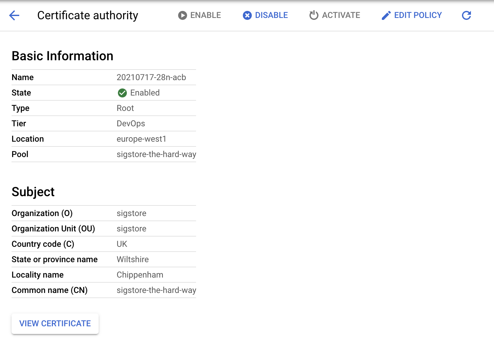
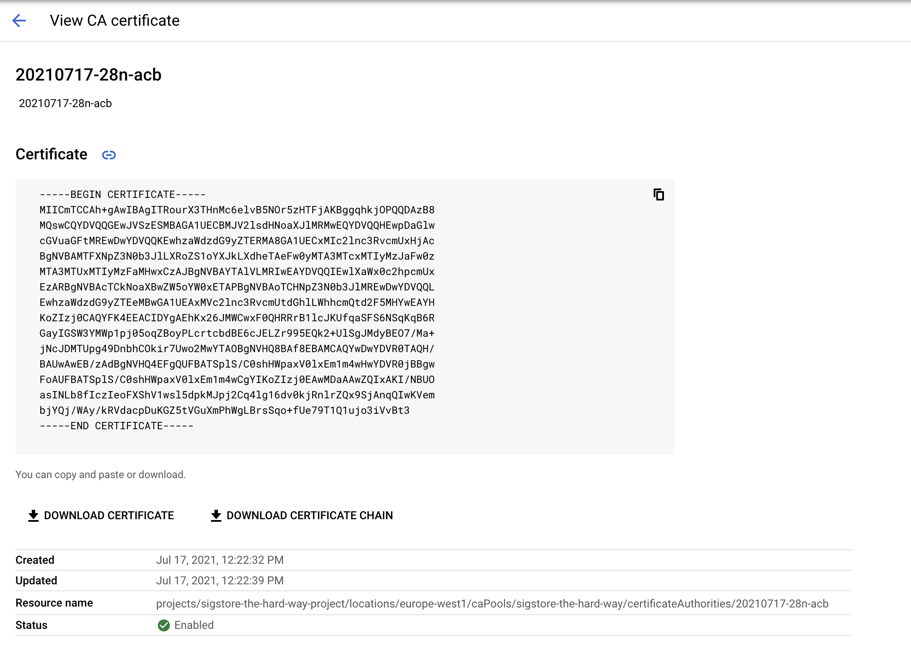

# Fulcio

Now it's time to install the Fulcio WebPKI.

Fulcio requires a means to manage certificates. We have two options here,
we can use a SoftHSM or Google Certificate Authority service.

> 📝 As of time of writing, plans are in place to support AWS Cloud HSM and
  Azure Dedicated HSM.

SSH into the Fulcio Compute instance

```bash
gcloud compute ssh sigstore-fulcio
```

## Dependencies

We need a few dependencies installed

Update your system

```bash
sudo apt-get update -y
```

If you want to save up some time, remove man-db first

```bash
sudo apt-get remove -y --purge man-db
```

Grab the following packages

```bash
sudo apt-get install git gcc haproxy softhsm certbot opensc -y
```

> 📝 If you plan to use GCP Certificate Service, you can drop SoftHSM and opensc

### Install latest golang compiler

Download and run the golang installer (system package are often older than what Fulcio requires):

```bash
curl -O https://storage.googleapis.com/golang/getgo/installer_linux
```

```bash
chmod +x installer_linux
```

```bash
./installer_linux
```

e.g.

```
Welcome to the Go installer!
Downloading Go version go1.20.4 to /home/luke/.go
This may take a bit of time...
Downloaded!
Setting up GOPATH
GOPATH has been set up!

One more thing! Run `source /home/$USER/.bash_profile` to persist the
new environment variables to your current session, or open a
new shell prompt.
```

As suggested run

```bash
source /home/$USER/.bash_profile
go version
go version go1.20.4 linux/amd64
```

### Install Fulcio

```bash
go install github.com/sigstore/fulcio@v1.3.1
```

```bash
sudo cp ~/go/bin/fulcio /usr/local/bin/
```

### Let's encrypt (TLS) & HA Proxy config

Let's create a HAProxy config, set `DOMAIN` to your registered domain and your
private `IP` address

```bash
DOMAIN="fulcio.example.com"
IP="10.240.0.11"
```

Let's now run certbot to obtain our TLS certs.

```bash
sudo certbot certonly --standalone --preferred-challenges http \
      --http-01-address ${IP} --http-01-port 80 -d ${DOMAIN} \
      --non-interactive --agree-tos --email youremail@domain.com
```

Move the PEM chain into place

```bash
sudo cat "/etc/letsencrypt/live/${DOMAIN}/fullchain.pem" \
    "/etc/letsencrypt/live/${DOMAIN}/privkey.pem" \
    | sudo tee "/etc/ssl/private/${DOMAIN}.pem" > /dev/null
```

Now we need to change certbot configuration for automatic renewal

Prepare post renewal script

```bash
cat /etc/letsencrypt/renewal-hooks/post/haproxy-ssl-renew.sh
#!/bin/bash

DOMAIN="fulcio.example.com"

cat "/etc/letsencrypt/live/${DOMAIN}/fullchain.pem" \
    "/etc/letsencrypt/live/${DOMAIN}/privkey.pem" \
    > "/etc/ssl/private/${DOMAIN}.pem"

systemctl reload haproxy.service
```

Make sure the script has executable flag set

```bash
sudo chmod +x /etc/letsencrypt/renewal-hooks/post/haproxy-ssl-renew.sh
```

Replace port and address in the certbot's renewal configuration file for the domain (pass ACME request through the haproxy to certbot)

```bash
sudo vim /etc/letsencrypt/renewal/fulcio.example.com.conf
```

```
http01_port = 9080
http01_address = 127.0.0.1
```

Append new line

```
post_hook = /etc/letsencrypt/renewal-hooks/post/haproxy-ssl-renew.sh
```

Prepare haproxy configuration

```bash
cat > haproxy.cfg <<EOF
defaults
    timeout connect 10s
    timeout client 30s
    timeout server 30s
    log global
    mode http
    option httplog
    maxconn 3000
    log 127.0.0.1 local0

frontend haproxy
    #public IP address
    bind ${IP}:80
    bind ${IP}:443 ssl crt /etc/ssl/private/${DOMAIN}.pem

    # HTTPS redirect
    redirect scheme https code 301 if !{ ssl_fc }

    acl letsencrypt-acl path_beg /.well-known/acme-challenge/
    use_backend letsencrypt-backend if letsencrypt-acl

    default_backend sigstore_fulcio

backend sigstore_fulcio
    server sigstore_fulcio_internal 0.0.0.0:5000

backend letsencrypt-backend
    server certbot_internal 127.0.0.1:9080
EOF
```

Inspect the resulting `haproxy.cfg` and make sure everything looks correct.

If so, copy it into place

```bash
sudo cp haproxy.cfg /etc/haproxy/
```

Check syntax

```bash
sudo /usr/sbin/haproxy -c -V -f /etc/haproxy/haproxy.cfg
```

### Start HAProxy

Let's now start HAProxy

```bash
sudo systemctl enable haproxy.service
sudo systemctl restart haproxy.service
sudo systemctl status haproxy.service
```

The above should print:
```bash
Synchronizing state of haproxy.service with SysV service script with /lib/systemd/systemd-sysv-install.
Executing: /lib/systemd/systemd-sysv-install enable haproxy
● haproxy.service - HAProxy Load Balancer
   Loaded: loaded (/lib/systemd/system/haproxy.service; enabled; vendor preset: enabled)
   Active: active (running) since Sun 2021-07-18 10:12:28 UTC; 58min ago
     Docs: man:haproxy(1)
           file:/usr/share/doc/haproxy/configuration.txt.gz
 Main PID: 439 (haproxy)
    Tasks: 2 (limit: 2322)
   Memory: 4.1M
   CGroup: /system.slice/haproxy.service
           ├─439 /usr/sbin/haproxy -Ws -f /etc/haproxy/haproxy.cfg -p /run/haproxy.pid
           └─444 /usr/sbin/haproxy -Ws -f /etc/haproxy/haproxy.cfg -p /run/haproxy.pid

Jul 18 10:12:27 sigstore-fulcio systemd[1]: Starting HAProxy Load Balancer...
Jul 18 10:12:28 sigstore-fulcio systemd[1]: Started HAProxy Load Balancer.
```

Test automatic renewal

```bash
sudo certbot renew --dry-run
```

# File CA setup

First we need to generate some keys and a root CA

```bash
openssl ecparam -genkey -name prime256v1 -noout -out unenc.key
openssl ec -in unenc.key -out file_ca_key.pem -des3
openssl ec -in file_ca_key.pem -pubout -out file_ca_pub.pem
openssl req -new -x509 -days 365 -extensions v3_ca -key file_ca_key.pem -out fulcio-root.pem
rm unenc.key
```

Copy all of the above key artifacts into `$HOME/fulcio-config/config`

> **Note**
> You will need the file_ca_pub.pem file for the TUF root of cosign, with the sign-container section towards the end

# SoftHSM Installation

> By default SoftHSM stores tokens in `/var/lib/softhsm/tokens/` directory, which is defined
  in `/etc/softhsm/softhsm2.conf` configuration file, below we will define a custom configuration for fulcio.

```bash
mkdir -p $HOME/fulcio-config/config
mkdir $HOME/fulcio-config/tokens
```

```bash
cat <<EOF | tee $HOME/fulcio-config/config/softhsm2.cfg > /dev/null
directories.tokendir = $HOME/fulcio-config/tokens
objectstore.backend = file
log.level = INFO
slots.removable = false
EOF
```

```bash
export SOFTHSM2_CONF="$HOME/fulcio-config/config/softhsm2.cfg"
```

```bash
echo 'export SOFTHSM2_CONF="$HOME/fulcio-config/config/softhsm2.cfg"' >> ~/.bash_profile
```

```bash
softhsm2-util --init-token --slot 0 --label fulcio --pin 2324 --so-pin 2324
```

Tokens will now be generated in `fulcio-config\tokens`

```bash
ls -la $HOME/fulcio-config/tokens
```

For example:

```bash
softhsm2-util --init-token --slot 0 --label fulcio
=== SO PIN (4-255 characters) ===
Please enter SO PIN: ****
Please reenter SO PIN: ****
=== User PIN (4-255 characters) ===
Please enter user PIN: ****
Please reenter user PIN: ******
ERROR: The entered PINs are not equal.
=== User PIN (4-255 characters) ===
Please enter user PIN: ****
Please reenter user PIN: ****
The token has been initialized and is reassigned to slot 1773686385
```

Lets create a SoftHSM config for Fulcio

```bash
cat <<EOF | tee $HOME/fulcio-config/config/crypto11.conf > /dev/null
{
  "Path" : "/usr/lib/softhsm/libsofthsm2.so",
  "TokenLabel": "fulcio",
  "Pin" : "2324"
}
EOF
```

> **Note**
> The Path may vary for different OS versions.

Now let's create a private key within the HSM

```bash
pkcs11-tool --module /usr/lib/softhsm/libsofthsm2.so --login --login-type user --keypairgen --id 1 --label PKCS11CA --key-type EC:secp384r1
```

For example:

```bash
pkcs11-tool --module /usr/lib/softhsm/libsofthsm2.so --login --login-type user --keypairgen --id 1 --label PKCS11CA --key-type EC:secp384r1
Using slot 0 with a present token (0x69b84e71)
Logging in to "fulcio".
Please enter User PIN:
Key pair generated:
Private Key Object; EC
label:      PKCS11CA
ID:         01
Usage:      decrypt, sign, unwrap, derive
Access:     sensitive, always sensitive, never extractable, local
Public Key Object; EC  EC_POINT 384 bits
EC_POINT:   046104b04911577ad1a655ba469b32ae63832d6c0d19482058af1822c2b42f54934da3613cd87171594a9b00ff1f0b298c75fa9383470ec46f0b4a35e73b54c34cf2ecc664ada2d0a818a5ac2390d952cb3b8d66ebea974a1bb2465f323cbebc50927d
EC_PARAMS:  06052b81040022
label:      PKCS11CA
ID:         01
Usage:      encrypt, verify, wrap, derive
Access:     local
```

Now its time to create a Root CA using our newly minted private key:

```bash
cd $HOME/fulcio-config/
fulcio createca --org={ORG} --country={UK} --locality={TOWN} --province={PROVINCE} --postal-code={POST_CODE} --street-address={STREET} --hsm-caroot-id 1 --out fulcio-root.pem
```

An example:

```bash
cd $HOME/fulcio-config/
fulcio createca --org=acme --country=USA --locality=Anytown --province=AnyPlace --postal-code=ABCDEF --street-address=123 Main St --hsm-caroot-id 1 --out fulcio-root.pem
2021-10-01T18:09:16.284Z        INFO    app/createca.go:48      binding to PKCS11 HSM
2021-10-01T18:09:16.289Z        INFO    app/createca.go:68      finding slot for private key: PKCS11CA
2021-10-01T18:09:16.304Z        INFO    app/createca.go:108     Root CA:
-----BEGIN CERTIFICATE-----
MIICJDCCAaqgAwIBAgIIVUu5cbwBx8EwCgYIKoZIzj0EAwMwVjELMAkGA1UEBhMC
TFYxCzAJBgNVBAgTAkxWMQswCQYDVQQHEwJMVjENMAsGA1UECRMESG9tZTEPMA0G
A1UEERMGTFYxMDI2MQ0wCwYDVQQKEwRhY21lMB4XDTIxMTAwMTE4MDkxNloXDTMx
MTAwMTE4MDkxNlowVjELMAkGA1UEBhMCTFYxCzAJBgNVBAgTAkxWMQswCQYDVQQH
EwJMVjENMAsGA1UECRMESG9tZTEPMA0GA1UEERMGTFYxMDI2MQ0wCwYDVQQKEwRh
Y21lMHYwEAYHKoZIzj0CAQYFK4EEACIDYgAEk4wYXHkLhdDlUlASZc65GI+5VDv3
OqmFdOI7/TwnPfrqFBNCxTPp0qNh7//s55tRac5pkXV4Af+xWUETlRd6RqBKcjjX
PHMZ0f+J/pZui4pPmw3ItvVCqfmNvCtASksSo0UwQzAOBgNVHQ8BAf8EBAMCAQYw
EgYDVR0TAQH/BAgwBgEB/wIBATAdBgNVHQ4EFgQUOXQnhKM/yhGTICrrgO78QyVN
nUMwCgYIKoZIzj0EAwMDaAAwZQIwEd1VjWI+P3eXMwUOGXbWJMYzrpcLakwj0JPW
Bx6oFXBadm4jZoKQX1FfNXMWgu0mAjEA4nz6OBtF8YJGRS9bTnWfe4V/lwukRczk
OPl9CeCgaJqQRXlMSw8uf3nO0rYXTGCF
-----END CERTIFICATE-----

2021-10-01T18:09:16.324Z        INFO    app/createca.go:122     root CA created with PKCS11 ID: 1
2021-10-01T18:09:16.324Z        INFO    app/createca.go:138     root CA saved to file: fulcio-root.pem
```

Check Root CA key usage

```bash
openssl x509 -in fulcio-root.pem -noout -ext extendedKeyUsage,keyUsage
X509v3 Key Usage: critical
    Certificate Sign, CRL Sign
```

Transfer the root certificate over to the certificate transparency log (or copy / paste into a text file for later).

```bash
gcloud compute scp fulcio-root.pem <google_account_name>@sigstore-ctl:~/
```

# Google Certificate Authority Service

Navigate to the [Certificate Authority Service API](https://console.cloud.google.com/marketplace/product/google/privateca.googleapis.com) and enable the service


On the Google Cloud Console page, go to Security > Certificate Authority Service > Create CA

1. Set the CA type (DevOps)

    

2. Set the cert subject details

    

3. Set the key and algorithm to Ecliptic Curve P384

    

4. Leave Configure Artifacts as it is

    

5. Label (don't need one)

    

6. Create the CA

    

7. Note down the Root CA and Resource name

    

    

# Fulcio Config

Set the DNS for the OAuth2 / Dex Server

```bash
OAUTH2_DOMAIN="oauth2.example.com"
```

```bash
cat > $HOME/fulcio-config/config.json <<EOF
{
  "OIDCIssuers": {
    "https://accounts.google.com": {
      "IssuerURL": "https://accounts.google.com",
      "ClientID": "sigstore",
      "Type": "email"
    },
    "https://${OAUTH2_DOMAIN}/auth": {
      "IssuerURL": "https://${OAUTH2_DOMAIN}/auth",
      "ClientID": "sigstore",
      "Type": "email"
    },
    "https://token.actions.githubusercontent.com": {
      "IssuerURL": "https://token.actions.githubusercontent.com",
      "ClientID": "sigstore",
      "Type": "github-workflow"
    }
  }
}
EOF
```

Inspect `config.json` and if everything looks in order, copy it into place

```bash
mv config.json $HOME/fulcio-config/
```

# Start FulcioCA

We now have two methods of starting Fulcio depending on your Certificate
Authority system choice.

In both cases you may create a bare minimal systemd service

```bash
cat /etc/systemd/system/fulcio.service
[Unit]
Description=fulcio
After=network-online.target
Wants=network-online.target
StartLimitIntervalSec=600
StartLimitBurst=5

[Service]
Environment=SOFTHSM2_CONF=/etc/fulcio-config/config/softhsm2.cfg
ExecStart=/usr/local/bin/fulcio serve --config-path=/etc/fulcio-config/config.json ...
WorkingDirectory=/etc/fulcio-config
Restart=on-failure
RestartSec=5s

[Install]
WantedBy=multi-user.target
```

```bash
sudo systemctl daemon-reload
sudo systemctl enable fulcio.service
sudo systemctl start fulcio.service
sudo systemctl status fulcio.service
```

## File CA

```bash
fulcio serve --config-path=$HOME/fulcio-config/config.json --ca=fileca --fileca-cert=fulcio-config/fulcio-root.pem  --fileca-key=fulcio-config/file_ca_key.pem --fileca-key-passwd=p6ssw0rd --ct-log-url=http://sigstore-ctl:6105/sigstore --host=0.0.0.0 --port=5000
```

## SoftHSM

```bash
fulcio serve --config-path=$HOME/fulcio-config/config.json --ca=pkcs11ca --hsm-caroot-id=1 --pkcs11-config-path=$HOME/fulcio-config/config/crypto11.conf --ct-log-url=http://sigstore-ctl:6105/sigstore --host=0.0.0.0 --port=5000
```

> 📝 Don't worry that the Certificate Transparency Log is not up yet. We will
 set this up next.

## Google Certificate Authority Service

```bash
fulcio serve --config-path=/etc/fulcio-config/config.json --ca googleca --gcp_private_ca_parent=${resource_name} --ct-log-url=http://sigstore-ctl:6105/sigstore --host=0.0.0.0 --port=5000
```

> 📝 Your resource name is a long POSIX type path string, e.g. `projects/sigstore-the-hard-way-proj/locations/europe-west1/caPools/sigstore-the-hard-way/certificateAuthorities/xxxx`

For example

```
fulcio serve --config-path=/etc/fulcio-config/config.json --ca googleca --gcp_private_ca_parent=projects/sigstore-the-hard-way-proj/locations/europe-west1/caPools/sigstore-the-hard-way/certificateAuthorities/xxxx --ctl-log-url=http://sigstore-ctl:6105/sigstore
```
